# Никоноров Денис - FOPS-8
# Домашнее задание к занятию «Конфигурация приложений»

### Задание 1. Создать Deployment приложения и решить возникшую проблему с помощью ConfigMap. Добавить веб-страницу

1. Создать Deployment приложения, состоящего из контейнеров nginx и multitool.
2. Решить возникшую проблему с помощью ConfigMap.
3. Продемонстрировать, что pod стартовал и оба конейнера работают.
4. Сделать простую веб-страницу и подключить её к Nginx с помощью ConfigMap. Подключить Service и показать вывод curl или в браузере.
5. Предоставить манифесты, а также скриншоты или вывод необходимых команд.

------

### Задание 2. Создать приложение с вашей веб-страницей, доступной по HTTPS 

1. Создать Deployment приложения, состоящего из Nginx.
2. Создать собственную веб-страницу и подключить её как ConfigMap к приложению.
3. Выпустить самоподписной сертификат SSL. Создать Secret для использования сертификата.
4. Создать Ingress и необходимый Service, подключить к нему SSL в вид. Продемонстировать доступ к приложению по HTTPS. 
4. Предоставить манифесты, а также скриншоты или вывод необходимых команд.

------

### Решение задания 1. Создать Deployment приложения и решить возникшую проблему с помощью ConfigMap. Добавить веб-страницу

Создан новый namespace 

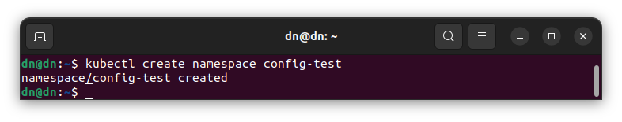

Написан манифест [deployment](/deployment.yml) применил его.

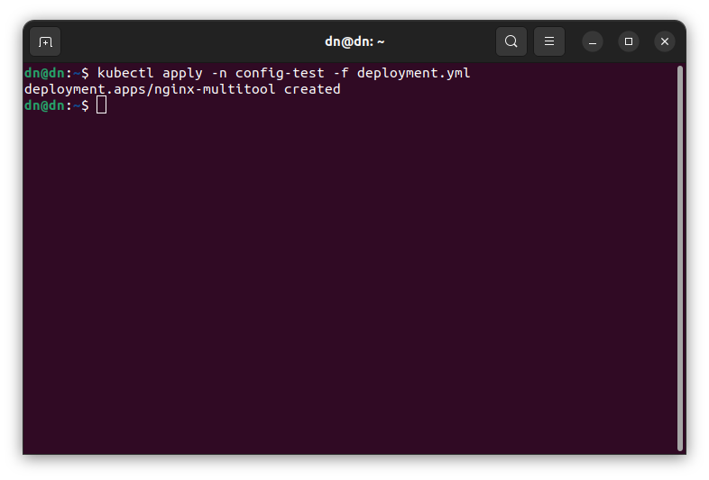

Проверяю его 

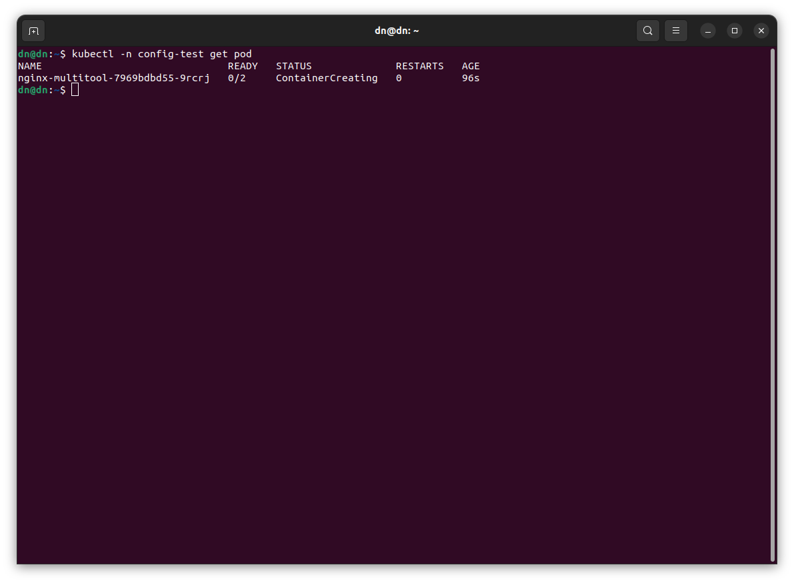

Видно что не запущен тк не запущен ConfigMap
[configmap](/configmap.yml)

Применил configmap 

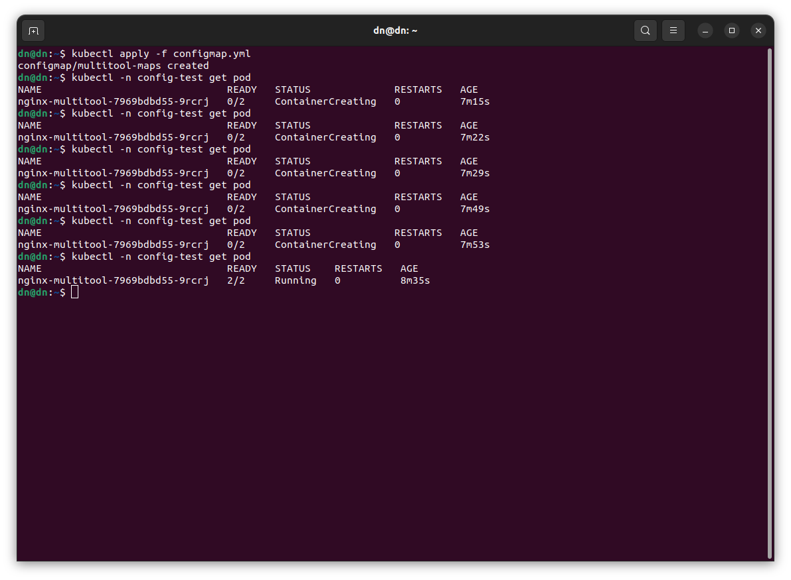

И видно что контейнер запустился

Сделана обычная веб страница и подключена к nginx в configmap. модернизирован Deployment, внес volumeMounts ссылающийся на путь по умолчанию для nginx, где находится индексная страница - /usr/share/nginx/html/, а также сошлюсь на сам ConfigMap. Подключен Service и применяю ConfigMap.

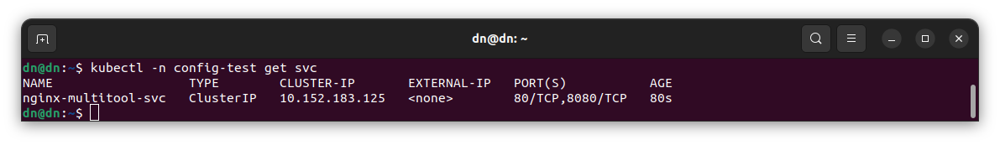

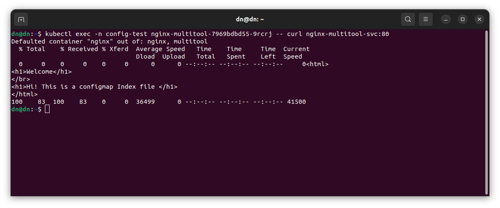

Видно работает.

### Решение задания 2. Создать приложение с вашей веб-страницей, доступной по HTTPS

Написан манифест [nginx_deploymnet](/nginx_deployment.yml) 

Манифет также использует volumeMounts, указывающий на расположение индексной страницы nginx.

[nginx_configmap](/nginx_configmap.yml) создана лайт веб страница и подключена как ConfigMap. В Deployment ссылаюсь на имя указанное в ConfigMap

Выпущен самоподписанный сертификат

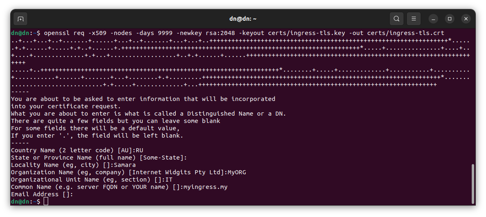

Создан секрет для использования сертификата 

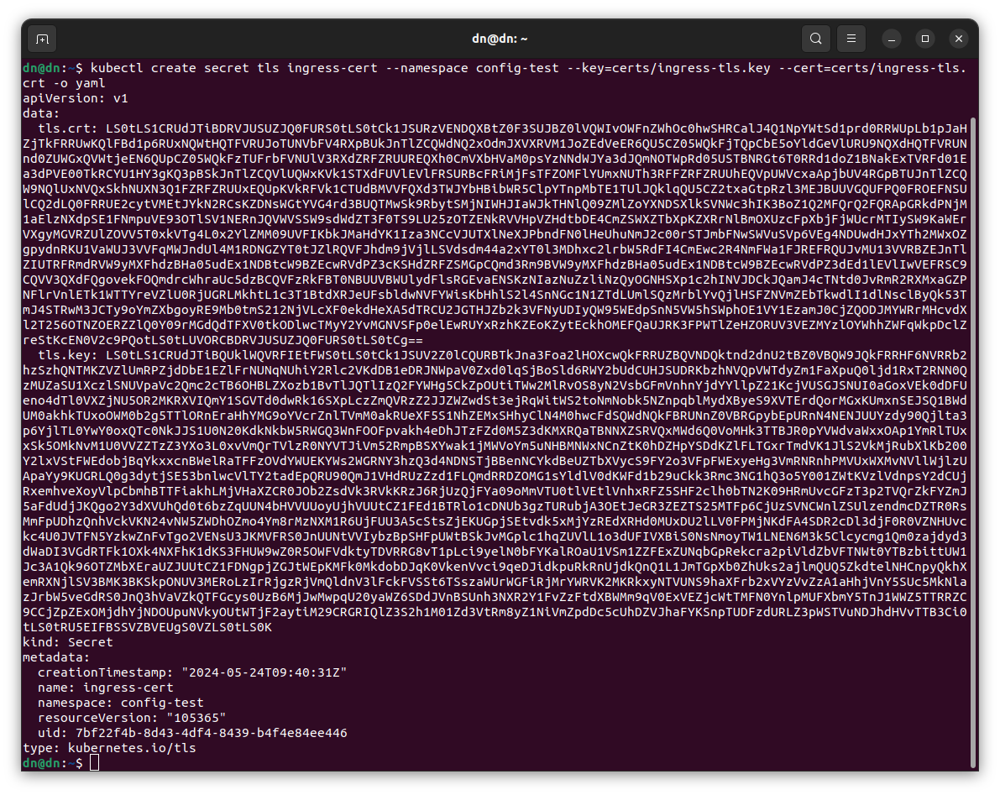

Файл сертификатов конвертирован в формат base64 и размещен в манифесте Secret

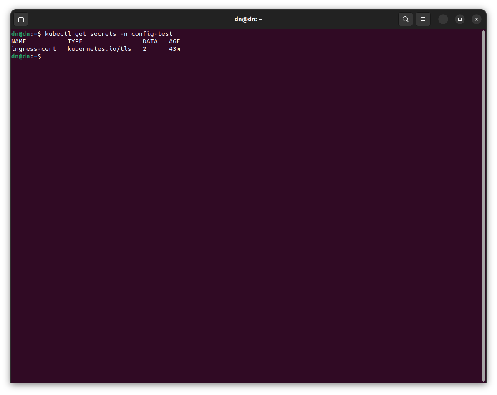

Создан Ingress [nginx_ingres](/nginx_ingress.yml) и необходимый Service [nginx_service](/nginx_service.yml)

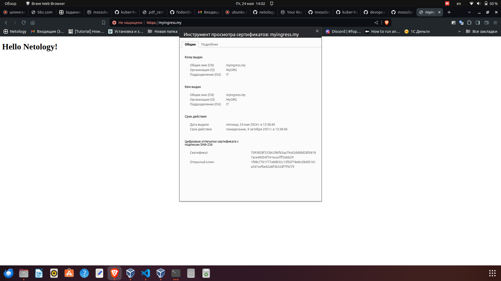

Сайт открывается, текст страницы берется из ConfigMap. Сертификат сайта подключен.

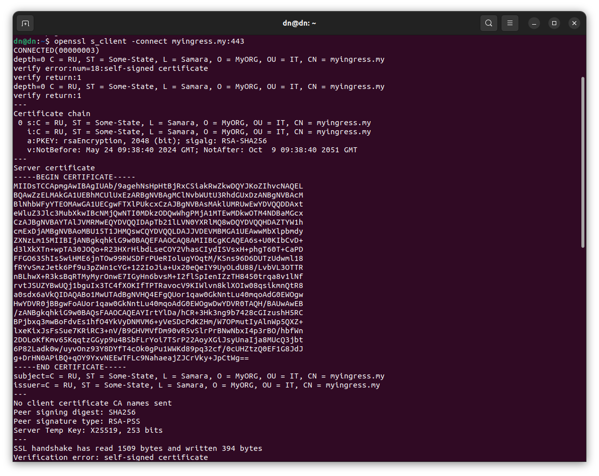